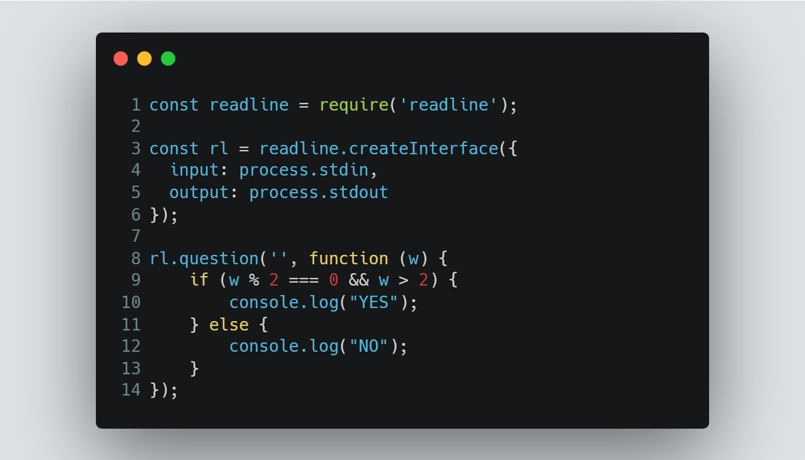
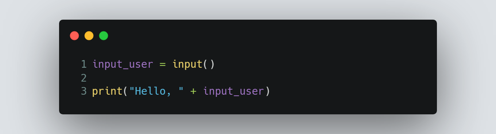

# Session 1 | Problem 1
## A. Say Hello With C++

### The Problem:
> Given a name S. Print "Hello, (name)" without parentheses.
> 
> Input: 
> * Only one line containing a string S.
> 
> Output:
> * Print "Hello, " without quotes, then print name.

---

### My Solution:
> #### Using Node.js | [solution in codeforces](https://codeforces.com/group/MWSDmqGsZm/contest/219158/submission/182629155)
> >  
---
> #### Using Python 3 | [solution in codeforces](https://codeforces.com/group/MWSDmqGsZm/contest/219158/submission/182628868)
> >  

