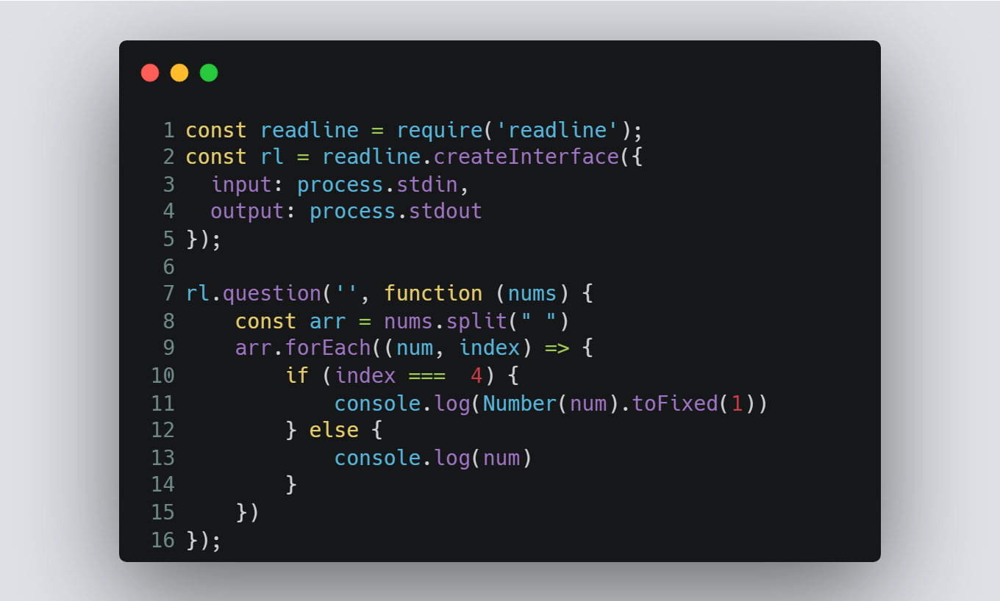

# Session 2 | Problem 1
## B - Basic Data Types

### The Problem:
> The following lines show some C++ data types, their format specifiers and their most common bit widths:
> * int : 32 Bit integer.
> * long long : 64 bit integer
> * Char : 8 bit Characters & symbols
> * Float : 32 bit real value
> * Double : 64 bit real value
> 
> Input: 
> * Only one line containing the following space-separated values: int, long long, char, float and double respectively.
> 
> Output:
> * Print each element on a new line in the same order it was received as input.

---

### My Solution:
> #### Using Node.js | [solution in codeforces](https://codeforces.com/group/MWSDmqGsZm/contest/219158/submission/184873990)
> >  
---

