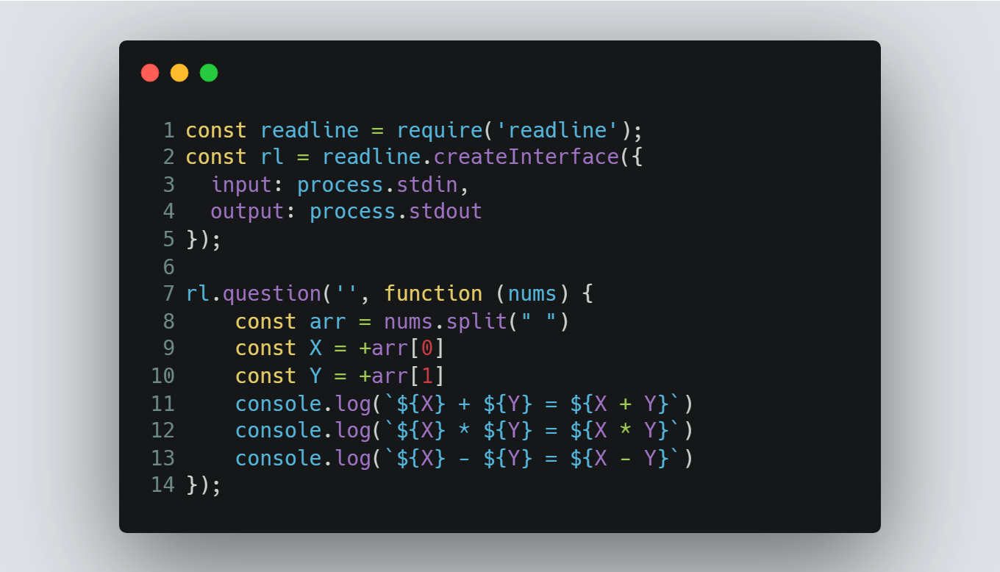

# Session 2 | Problem 2
## C - Simple Calculator

### The Problem:
> Given two numbers X and Y. Print the summation and multiplication and subtraction of these 2 numbers.
> 
> Input: 
> * Only one line containing two separated numbers X, Y (1  ≤  X, Y  ≤  105).
> 
> Output:
> * Print 3 lines that contain the following in the same order:
> * X + Y = summation result" without quotes.
> * X * Y = multiplication result" without quotes.
> * X - Y = subtraction result" without quotes.

---

### My Solution:
> #### Using Node.js | [solution in codeforces](https://codeforces.com/group/MWSDmqGsZm/contest/219158/submission/184871498)
> >  
---

