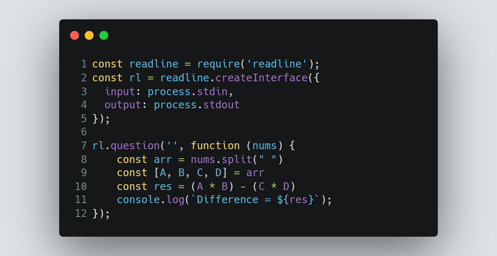

# Session 2 | Problem 1
## D. Difference

### The Problem:
> Given four numbers A, B, C and D. Print the result of the following equation :
> * X = (A * B) - (C * D).
> 
> Input: 
> * Only one line containing 4 separated numbers A, B, C and D ( - 105  ≤  A, B, C, D  ≤  105).
> 
> Output:
> * Print "Difference  =  " without quotes followed by the equation result.

---

### My Solution:
> #### Using Node.js | [solution in codeforces](https://codeforces.com/group/MWSDmqGsZm/contest/219158/submission/184870975)
> >  
---

