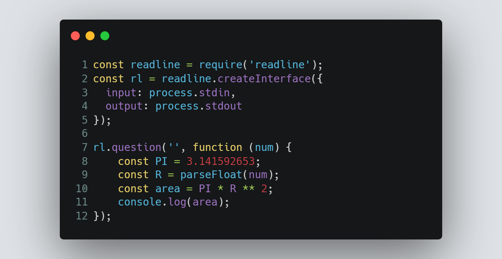

# Session 3 | Problem 1
## E. Area of a Circle

### The Problem:
> Given a number R calculate the area of a circle using the following formula:
> 
> Area = π * R2.
> 
> Note: consider π = 3.141592653.
> 
> Input: 
> * Only one line containing the number R (1  ≤  R  ≤  100).
> 
> Output:
> * Print the calculated area, with 9 digits after the decimal point.

---

### My Solution:
> #### Using Node.js | [solution in codeforces](https://codeforces.com/group/MWSDmqGsZm/contest/219158/submission/184868419)
> >  
---

