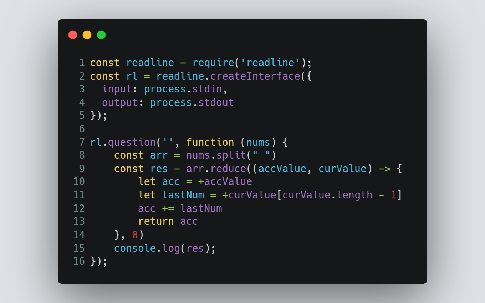

# Session 3 | Problem 2
## F. Digits Summation

### The Problem:
> Given two numbers N and M. Print the summation of their last digits.
> 
> Input: 
> * Only one line containing two numbers N, M (0 ≤ N, M ≤ 1018).
> 
> Output:
> * Print the answer of the problem.

---

### My Solution:
> #### Using Node.js | [solution in codeforces](https://codeforces.com/group/MWSDmqGsZm/contest/219158/submission/184870281)
> >  
---

