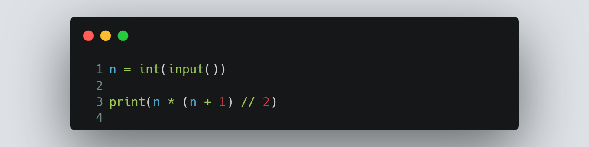

# Session 4 | Problem 1
## G - Summation from 1 to N

### The Problem:
> Given a number N Print the summation of the numbers that is between 1 and N (inclusive)
>
> Input:
> * Only one line containing a number N (1≤N≤109)
>
> Output: 
> * Print the summation of the numbers that are between 1 and N (inclusive).
---

### My Solution:
> #### Using Python | [solution in codeforces](https://codeforces.com/group/MWSDmqGsZm/contest/219158/submission/186286165)
> >  
---

