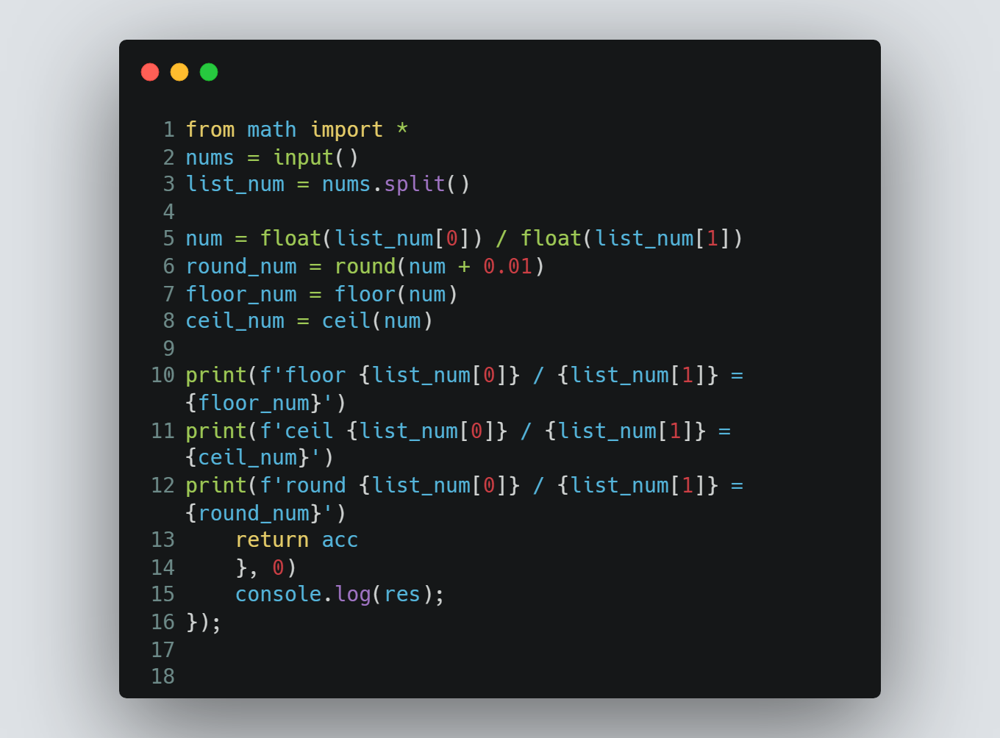

# Session 4 | Problem 2
## H. Two numbers

### The Problem:
> Given 2 numbers A and B. Print floor, ceil and round of A/B
>
> Note:
> 
> * Floor: Is a mathematical function that takes a real number X and its output is the greatest integer less than or equal to X.
> * Ceil: Is a mathematical function that takes a real number X and its output is the smallest integer larger than or equal to X.
> * Round: Is a mathematical function that takes a real number X and its output is the closest integer to that number X.
> 
> Input: 
> * Only one line containing two numbers A and B (1≤A,B≤103)
> 
> Output:
> * Print 3 lines that contain the following in the same order:
>   * floor A / B = Floor result" without quotes.
>   * ceil A / B = Ceil result" without quotes.
>   * round A / B = Round result" without quotes.
---

### My Solution:
> #### Using Python | [solution in codeforces](https://codeforces.com/group/MWSDmqGsZm/contest/219158/submission/186034282)
> >  
---

