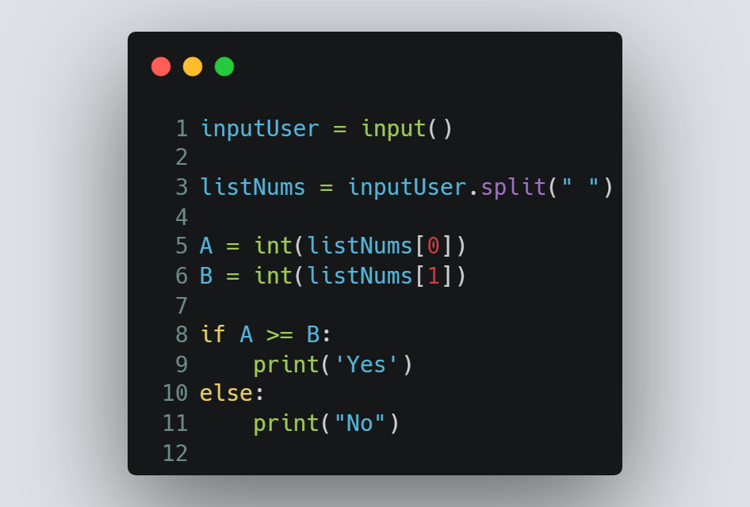

# Session 6 | Problem 1
## I. Welcome for you with Conditions

### The Problem:
> Given two numbers A and B. Print "Yes" if A is greater than or equal to B. Otherwise print "No".
>
> Input:
> * Only one line containing two numbers A and B (0  ≤  A, B  ≤  100).
>
> Output: 
> * Print "Yes" or "No" according to the statement.
---

### My Solution:
> #### Using Python | [solution in codeforces](https://codeforces.com/group/MWSDmqGsZm/contest/219158/submission/197881985)
> >  
---

