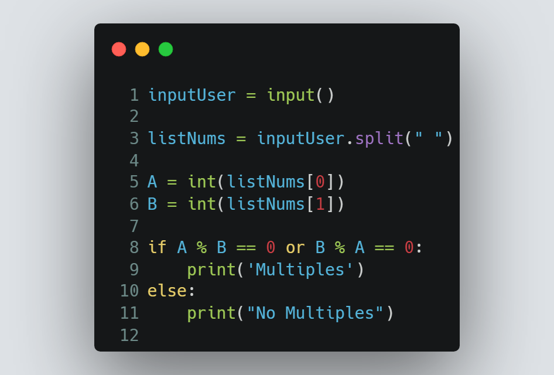

# Session 6 | Problem 2
## J. Multiples

### The Problem:
> Given two numbers A and B. Print "Multiples" if A is multiple of B or vice versa. Otherwise print "No Multiples".
>
> Input:
> * Only one line containing two numbers A, B (1  ≤  A, B  ≤  10**6)
>
> Output: 
> * Print the "Multiples" or "No Multiples" corresponding to the read numbers.
---

### My Solution:
> #### Using Python | [solution in codeforces](https://codeforces.com/group/MWSDmqGsZm/contest/219158/submission/197882523)
> >  
---

