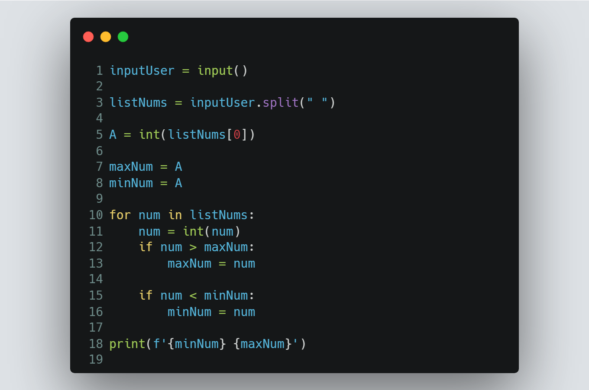

# Session 6 | Problem 3
## K. Max and Min

### The Problem:
> Given 3 numbers A, B and C, Print the minimum and the maximum numbers.
>
> Input:
> * Only one line containing 3 numbers A, B and C `(-10**5 ≤ A, B, C ≤ 10**5)`
>
> Output: 
> * Print the **minimum** number followed by a single space then print the **maximum** number.
---

### My Solution:
> #### Using Python | [solution in codeforces](https://codeforces.com/group/MWSDmqGsZm/contest/219158/submission/197884241)
> >  
---

