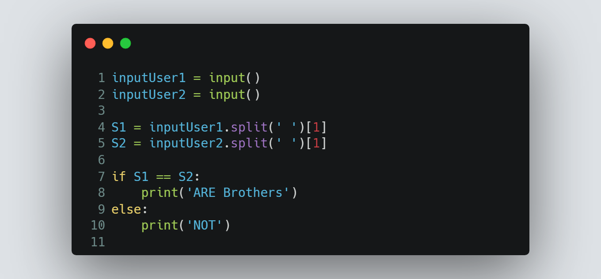

# Session 7 | Problem 1
## L. The Brothers

### The Problem:
> Given two person names.
>
> Each person has {"the first name" + "the second name"}
> 
> Determine whether they are brothers or not.
> 
> Note: The two persons are brothers if they share the same second name.
>
> Input:
> * First line will contain two Strings F1, S1 which donates the first and second name of the 1st person.
> * Second line will contain two Strings F2, S2 which donates the first and second name of the 2nd person.
>
> Output: 
> * Print **"ARE Brothers"** if they are brothers otherwise print **"NOT"**.
---

### My Solution:
> #### Using Python | [solution in codeforces](https://codeforces.com/group/MWSDmqGsZm/contest/219158/submission/198645343)
> >  
---

