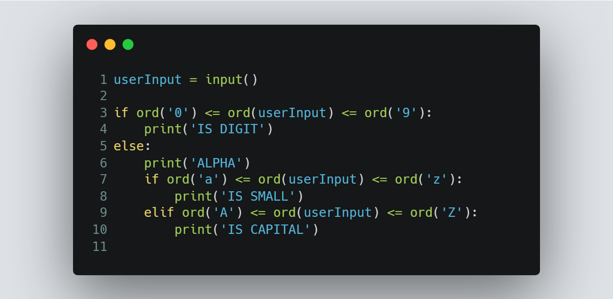

# Session 7 | Problem 2
## M. Capital or Small or Digit

### The Problem:
> Given a letter X. Determine whether X is Digit or Alphabet and if it is Alphabet determine if it is Capital Case or Small Case.
> 
> * Note:
>   * Digits in ASCII '0' = 48,'1' = 49 ....etc
>   * Capital letters in ASCII 'A' = 65, 'B' = 66 ....etc
>   * Small letters in ASCII 'a' = 97,'b' = 98 ....etc
>
> Input:
> * Only one line containing a character X which will be a capital or small letter or digit.
>
> Output: 
> * Print a single line contains **"IS DIGIT"** if X is digit otherwise, print **"ALPHA"** in the first line followed by a new line that contains **"IS CAPITAL"** if X is a capital letter and **"IS SMALL"** if X is a small letter.
---

### My Solution:
> #### Using Python | [solution in codeforces](https://codeforces.com/group/MWSDmqGsZm/contest/219158/submission/198647785)
> >  
---

