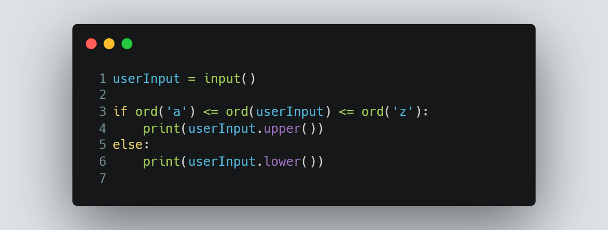

# Session 7 | Problem 3
## N. Char

### The Problem:
> Given a letter X. If the letter is lowercase print the letter after converting it from lowercase letter to uppercase letter. Otherwise print the letter after converting it from uppercase letter to lowercase letter
> 
> Note : difference between 'a' and 'A' in ASCII is 32 .
>
> Input:
> * Only one line containing a character X which will be a **capital** or **small** letter.
>
> Output: 
> * Print the answer to this problem.
---

### My Solution:
> #### Using Python | [solution in codeforces](https://codeforces.com/group/MWSDmqGsZm/contest/219158/submission/198648041)
> >  
---

